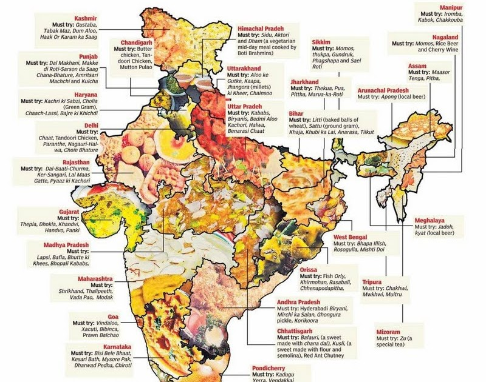

# Portfolio
# Data Enthusiast
#### Technical Skills:
##### Gen AI:
AWS Bedrock, Bedrock Knowledge bases, Retrieval-Augmented Generation (RAG), OpenAI API, Ollama, Mistral AI, Hugging Face, Anthropic Claude
##### Programming Languages: 
Python, R, Matlab
##### Databases: 
SQL, MongoDB, PostgreSQL, Redis, NoSQL
##### Data Science, Analysis & Visualization: 
RStudio, Pandas, Numpy, Matplotlib, OpenCV, Seaborn, SKlearn, TensorFlow, SciPy, PyTorch, Jupyter, Tableau, MS Excel
##### Tools/Technologies: 
Github, AWS, Azure, Snowflake, ZohoCRM

## Education
- M.S.Computer Science | University of Central Missouri (Expected Graduation, May 2025)								       			 			        		
- B.Tech.Computer Science(Spl DataAnalytics) | Vellore Institute of Technology (May 2023)

## Work Experience
**AI Intern (Full Time) @ HydroTek Farm LLC (_June 2025 — Present_)**
–	Designing and executed benchmark evaluations across Claude, GPT, Mistral, and Bedrock for plant disease diagnostics, improving
top-3 model accuracy and increasing test yield forecasting accuracy by 12%.
–	Building a GitLab-driven CI/CD pipeline for a Flutter + Firebase app using AWS serverless stack (S3 triggers → Lambda → Bedrock for AI inference → DynamoDB); deploying via SAM with CloudWatch logging, alarms, and secure environment variable management.

**AI Intern @ HydroTek Farm LLC (_Jan 2025 — May 2025_)**
–	Developing an AI-based system to analyse plant health and detection anomalies through image inputs, improving decision-making accuracy and contributing to customer satisfaction.Deployed scaled AI solutions using AWS BedRock, integrating automated health reporting workflows for real-time insights.
-Exploring and implementing state-of-the-art AI frameworks..

**Open source project @ HydroTek Farm (Github) (_May 2024 — Oct 2024_)**
- Expanded the project by incorporating a camera for hydroponic farm disease detection and training a model with Roboflow to predict plant diseases and provide clients with remediation instructions.
- The model will soon be integrated into an NVIDIA Jetson, which will be connected to an Iot box for real-time monitoring.
- Led the charge in assembling data on particular plants and was instrumental in updating the status diagram.

**Data Intern @ LTI Mindtree (_Feb 2023 — June 2023_)**
- Received training in basic data science software and principles, significantly improving accuracy levels during the internship.

**Data Intern @ Oriana Info Tech LLP (_Nov 2022 — Apr 2023_)**
- Analyzed and visualized spatial data using Python, Seaborn, and Folium to identify patterns and trends. Developed interactive visualizations to present findings and support decision-making.

## Projects
### ScrubPrep: AI-Powered Medical Exam Assistant [Github](https://github.com/Pravali2002/ScrubPrep)
Motivated by my sister’s struggle with dense medical textbooks during her postgraduate exam prep, I set out to build ScrubPrep — an AI assistant that answers clinical questions by grounding responses in real textbook content. Using Retrieval-Augmented Generation (RAG), the chatbot accurately retrieves and synthesizes information from custom-ingested medical PDFs to provide clear, trustworthy explanations tailored to medical students.
To bring this idea to life, I leveraged LangChain, FAISS, and Pinecone for semantic search, paired with FastAPI and basic UI to deliver an intuitive full-stack experience. I collaborated closely with my sister to test the assistant using real exam-style questions, fine-tuning the system to prioritize clarity, accuracy, and zero hallucination.
This project blends AI, information retrieval, and domain-specific evaluation to demonstrate how well-grounded generative models can transform learning experiences in high-stakes fields like medicine.

### Dishcovery: Exploring the Indian Culinary Spectrum [Github](https://github.com/Pravali2002/Dishcovery)
I dived into the diverse world of Indian cuisine by analyzing dietary patterns, ingredient distributions, and cooking times across various states. Leveraging Python and advanced data visualization libraries, I uncovered regional food trends and created engaging visual narratives to highlight the culinary diversity of India. To enhance insights, I developed interactive choropleth maps and sophisticated visualizations, along with a ranking algorithm to evaluate recipe complexity. Additionally, I employed Natural Language Processing (NLP) techniques to analyze ingredient frequencies, providing a deeper understanding of the elements that define India’s rich culinary heritage. This project blends data science and storytelling to celebrate the art of Indian cooking.

### Contact Tracing using ML [Github](https://github.com/Pravali2002/Contact-Tracing-Using-Machine-Learning)
Used **ML Modeling** and developed and executed a Contact Tracing project using DBSCAN clustering and geospatial data, visualizing infected clusters with Folium and Seaborn for proximity-based analysis. My json file consisted of latitude and longitude information instead of phone numbers which helps in protecting the people's privacy.
Integrated real-time geolocation data to provide actionable insights into infection spread patterns and areas at risk, contributing to public health data science applications.

### Crop recommendation system [Github](https://github.com/Pravali2002/The-Crop-Recommendation-System)
Machine learning techniques are utilized in various sectors, from evaluating customer behavior in supermarkets to predicting customer phone usage. 
For some years, agriculture has been using machine learning techniques. Crop prediction is one of agriculture's complex challenges, and several models have been developed and proven so far. 

Agriculture is the main industry that generates income for the majority of developing nations. The field of modern agriculture is always expanding in terms of farming methods and agricultural advancements.
The project used machine learning to estimate the best crop for each area, automating the process with **Microsoft FLAML**. It compared the accuracy of models like **KNN, SVM, Naive Bayes, Decision Trees, and Random Forests** to recommend the optimal crop for specific environments.
Started this as a Capstone project and presented it at the **INTERNATIONAL CUKUROVA AGRICULTURE AND VETERINARY CONGRESS** Conference.
### Online Food Ordering System website (Emotional Eating) 
Developed an online food ordering system for easy order placement, order tracking, and improved delivery service. The system includes mood-based food preferences. Utilized MySQL, PHP, HTML, and AWS (EC2, Cognito, RDS, Route53, VPC).
**What's so new??**

Together with the types of cuisine I added food that are often consumed during particular season to make the taste palate of the user happy at that time. I took an idea from emotional eating topic and provided the user an option to store their food according to their mood.

### Music genre classification  [Github](https://github.com/Pravali2002/MusicGenreClassification)
This system accurately categorizes songs based on their style, which supports music recommendation systems, personalized playlists, and targeted marketing strategies for various domains, including streaming platforms, radio stations, and advertising using Machine Learning classification models.

### Do Left hand People Really Die Young [Github](https://github.com/Pravali2002/Do-left-hand-people-die-young-)
The percentage of left-handed people did increase significantly in the 20th century. The primary goal is to dispel the myth that people die young from sin, which is one of the most ridiculous excuses we are told. And to prove this I used **Bayes' rule** 

Research suggests left-handed individuals may live shorter lives due to increased risks in a right-handed dominated world. 

## Publications
[Publication](https://www.igi-global.com/chapter/medical-information-modeling-for-diabetes-based-on-logistic-regression/306170)
**Medical Information Modeling for Diabetes** Based on Logistic Regression Karthika Natarajan, Anjali Gautam, Pravalika Somisetty, Ramya Venigalla, Veeramachaneni Jhansi Lekha. Handbook of Research on Mathematical Modeling for Smart Healthcare Systems. 
